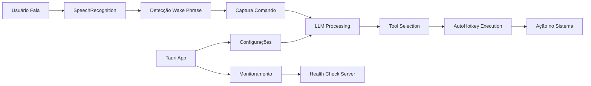

# 🤖 Neuro Desk

<div align="center">


**Assistente de automação por voz para Windows com IA integrada**

[Features](#-features) • [Instalação](#-instalação) • [Configuração](#-configuração) • [Uso](#-uso) • [Arquitetura](#-arquitetura) • [Desenvolvimento](#-desenvolvimento)

</div>

---

## 📋 Sobre o Projeto

O **Neuro Desk** é um assistente de automação inteligente para Windows que permite controlar seu computador através de comandos de voz. Usando tecnologia de IA (LLM) e integração profunda com o sistema operacional, o assistente pode executar uma ampla gama de tarefas de automação, desde abrir aplicativos até gerenciar janelas e controlar monitores múltiplos.

### 🎯 Principais Objetivos

- **Automação por Voz**: Controle total do sistema através de comandos naturais 
- **Integração com IA**: Processamento inteligente de comandos usando LLMs (Ollama/OpenAI)
- **Interface Moderna**: App desktop com React e Tauri para configuração e monitoramento
- **Extensibilidade**: Sistema modular que permite adicionar novos comandos e integrações

## ✨ Features

### 🖥️ Gerenciamento de Janelas
- **Abrir aplicações**: Launch de qualquer programa instalado
- **Posicionamento**: Mover janelas para posições específicas (topo, base, esquerda, direita)
- **Maximizar/Minimizar**: Controle de estado das janelas
- **Split Screen**: Divisão de tela entre duas aplicações
- **Multi-monitor**: Suporte completo para múltiplos monitores

### 🎮 Automação Avançada
- **Planos de Execução**: Sequências de ações pré-configuradas
- **Perfis do Chrome**: Abertura rápida com perfis específicos
- **Controle de Volume**: Ajuste por aplicação ou sistema
- **Controle de Monitores**: Ativar/desativar monitores específicos
- **Apps Customizados**: Registro de aplicações com caminhos personalizados

### 🛠️ Interface de Configuração
- **Dashboard Moderno**: Interface React com Tailwind CSS
- **Configurações Gerais**: Wake phrase, provedor de LLM, API keys
- **Gerenciamento de Planos**: Criar e editar sequências de automação
- **Monitoramento**: Visualização de logs em tempo real
- **Status do Sistema**: Indicador de status do assistente

### 🤖 Integração com IA
- **Suporte Multi-Provider**: Ollama (local) ou OpenAI (cloud)
- **Modelos Flexíveis**: Configuração de diferentes modelos LLM
- **Processamento Contextual**: Entendimento de comandos complexos
- **Validação Inteligente**: Verificação de ações antes da execução

## 🚀 Pré-requisitos

- **Windows 10/11** (64-bit)
- **Node.js** v18+ e npm
- **Rust** (para compilação do Tauri)
- **Python** 3.10+ (para scripts de automação)
- **Microfone** funcional para comandos de voz

### Configurando o Ambiente

1. **Tauri**
- Siga a própria documentação deles para poder rodar o app Tauri https://v2.tauri.app/start/prerequisites/
- Com as ferramentas necessárias instaladas:
```bash
cd app
npm install
```
2. **Back (python)**
```bash
cd scripts
python -m venv venv
python install -r requirements.txt
```

## 💻 Executando em Desenvolvimento

### Build do código python 
```bash
cd scripts
python build.py
```

### Frontend (Tauri + React)
```bash
cd app
npm run tauri dev  
```

### ‼️ Caso faça alterações de algo no back, execute o build para que o Front tenha acesso ao .exe atualizado
```bash
cd scripts
python build.py
```

### Caso queira testar a execução do script sem o Front
```bash
cd scripts
python main.py
```

## 💾 Instalação 
Acesse a aba de releases do repositório e baixe o executável mais atualizado.


## ⚙️ Configuração

### 1. Configuração Inicial

Ao abrir o aplicativo pela primeira vez:

1. **Configure a frase de ativação** (padrão: "Olá Jarvis")
2. **Escolha o provedor de LLM**:
   - **Ollama**: Para processamento local
   - **OpenAI**: Para usar modelos da OpenAI (requer API key)

### 2. Configuração de Apps Customizados

Caso você perceba que algum programa não conseguiu ser aberto automaticamente, vá para a aba "Custom Apps" e adicione o aplicativo:

```json
{
  "name": "MeuApp",
  "exe_path": "C:\\Caminho\\Para\\MeuApp.exe"
}
```

### 3. Criação de Planos de Execução

Na aba "Execution Plans", crie sequências de ações:

```json
{
  "name": "Trabalho Matinal",
  "run_on_startup": true,
  "actions": [
    {
      "action_type": "launch_app",
      "target": "vscode"
    },
    {
      "action_type": "launch_chrome",
      "profile": "Trabalho",
      "tabs": ["gmail.com", "github.com"]
    },
    {
      "action_type": "split_screen",
      "left": "vscode",
      "right": "chrome"
    }
  ]
}
```

### 4. Perfis do Chrome

Configure diferentes perfis para contextos específicos:

```json
{
  "name": "Trabalho",
  "shortcut_path": "C:\\Users\\User\\Desktop\\Chrome Trabalho.lnk"
}
```

## 📖 Uso

### Iniciando o Assistente

1. **Abra o aplicativo Neuro Desk**
2. **Clique em "Start Assistant"** ou configure para iniciar com o Windows
3. **Aguarde a confirmação** de que o assistente está escutando

### Comandos de Voz Básicos

Diga a frase de ativação seguida do comando:

- **"Olá Jarvis (aguarde feedback sonoro), abra o Chrome"**
- **"Olá Jarvis (aguarde feedback sonoro), mova o VSCode para a esquerda"**
- **"Olá Jarvis (aguarde feedback sonoro), maximize o Spotify"**
- **"Olá Jarvis (aguarde feedback sonoro), divida a tela entre Chrome e VSCode"**
- **"Olá Jarvis (aguarde feedback sonoro), execute o plano Trabalho Matinal"**
- **"Olá Jarvis (aguarde feedback sonoro), aumente o volume do Spotify"**
- **"Olá Jarvis (aguarde feedback sonoro), desative o monitor 2"**

### Monitoramento

- Acesse a aba **"Logs"** para ver ações em tempo real
- O **indicador de status** mostra o estado atual do assistente:
  - 🟢 **Running**: Escutando por comandos
  - 🟡 **Processing**: Processando comando
  - 🔴 **Offline**: Assistente desligado

## 🏗️ Arquitetura

### Estrutura do Projeto

```
neuro-desk/
├── app/                      # Frontend Tauri + React
│   ├── src/                  # Código React
│   │   ├── components/       # Componentes UI
│   │   ├── hooks/           # React hooks customizados
│   │   └── types.ts         # TypeScript types
│   ├── src-tauri/           # Backend Rust/Tauri
│   │   ├── src/             # Código Rust
│   │   │   ├── main.rs      # Entry point
│   │   │   ├── settings.rs  # Gerenciamento de configurações
│   │   │   ├── health.rs    # Health check do assistente
│   │   │   ├── auth.rs      # Autenticação
│   │   │   └── logs.rs      # Sistema de logs
│   │   └── resources/       # Recursos empacotados
│       
├── scripts/                  # Backend Python
│   ├── main.py              # Loop principal do assistente
│   ├── assistant.py         # Reconhecimento de voz
│   ├── executor.py          # Executor de comandos com LLM
│   ├── tools.py             # Ferramentas de automação
│   ├── health_check.py      # Servidor HTTP de status
│   ├── helpers/             # Módulos auxiliares
│   │   ├── config.py        # Configurações
│   │   ├── ollama_manager.py # Gerenciador Ollama
│   │   └── auth_validator.py # Validação de licença
│   ├── modules/             # Scripts AutoHotkey
│   │   ├── launch_app.ahk   # Abrir aplicações
│   │   ├── move_window.ahk  # Mover janelas
│   │   └── split_screen.ahk # Dividir tela
│   └── prompts/             # Templates para LLM
│       └── agent_executor.md # Instruções do agente
```

### Stack Tecnológica

#### Frontend
- **Tauri 2.0**
- **React 19**
- **TypeScript**
- **Tailwind CSS 4**
- **shadcn/ui**
- **Vite**

#### Backend Python
- **SpeechRecognition**
- **LangChain**
- **Ollama/OpenAI**
- **PyAudio**
- **PyInstaller**

### Fluxo de Dados



## 🤝 Contribuindo

Contribuições são bem-vindas! Por favor:

1. Fork o projeto
2. Crie uma branch para sua feature (`git checkout -b feature/AmazingFeature`)
3. Commit suas mudanças (`git commit -m 'Add some AmazingFeature'`)
4. Push para a branch (`git push origin feature/AmazingFeature`)
5. Abra um Pull Request

### Contato

Para suporte adicional ou reportar bugs, abra uma issue no GitHub.

---

<div align="center">

Desenvolvido com ❤️ para aumentar sua produtividade


</div>